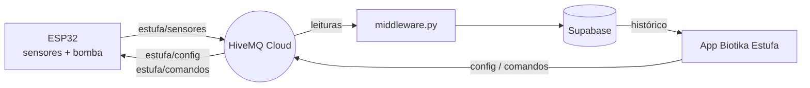

<div align="center">

# 🌱 Biotika Estufa · Firmware ESP32

Firmware em **MicroPython** que monitora e controla uma estufa inteligente de pequeno porte:
lê os sensores, decide a irrigação na própria placa e conversa com a nuvem via **MQTT sobre TLS**.


</div>

---

## ✨ Funcionalidades

- 🌡️ **Monitoramento** de temperatura, umidade do ar, umidade do solo e luminosidade
- 💧 **Irrigação automática na borda (edge computing):** se a umidade do solo cair abaixo do `umi_min` da cultura, a bomba rega em **pulsos de no máximo 3 s**, com pausa mínima de 60 s entre regas automáticas para a água se espalhar antes de medir de novo (evita encharcar)
- ⏱️ **Rega manual também limitada a 3 s** — a bomba sempre desliga sozinha
- 📴 **Modo offline:** sem Wi-Fi/broker a estufa continua lendo e irrigando, e registra no log cada leitura (`[OFFLINE] Leitura registrada -> ...`)
- 🟢 **Status online/offline** em `estufa/status` com *last will* (o broker avisa se a placa cair)
- 🌿 **Limites por cultura** recebidos pelo app e salvos na flash (`config_estufa.json`), mantidos após reinícios
- 🕹️ **Comandos manuais** para ligar/desligar a bomba remotamente
- 🔐 **MQTT com TLS** (porta 8883) e reconexão automática ao broker

## 🔄 Como funciona



Na placa, o `boot.py` conecta ao Wi-Fi, o `main.py` inicia o controlador (carrega os limites da flash e conecta ao broker) e, a cada **10 s**, o loop verifica mensagens → lê os sensores → decide a bomba → publica as leituras.

## 🗂️ Estrutura do projeto

```
esp32-config/
├── .vscode/
│   └── settings.json        # Define src/ como pasta sincronizada com a placa (MicroPico)
├── src/                     # 📦 Tudo aqui é enviado para o ESP32
│   ├── .vscode/             # Pylance + stubs do MicroPython e extensões recomendadas
│   ├── .micropico           # Configuração da extensão MicroPico
│   ├── lib/                 # Bibliotecas externas / drivers
│   │   ├── bh1750.py        # Driver do sensor de luminosidade BH1750
│   │   └── umqttsimple.py   # Cliente MQTT leve com suporte a TLS
│   ├── boot.py              # 1º a executar: conexão Wi-Fi
│   ├── main.py              # 2º a executar: inicia o controlador e o loop principal
│   ├── controller.py        # Orquestra MQTT, leituras e lógica de irrigação
│   ├── sensors.py           # Leitura do DHT11, umidade do solo (ADC) e BH1750 (I2C)
│   ├── actuators.py         # Controle do relé da bomba d'água
│   ├── config_manager.py    # Salva/carrega os limites da cultura na flash (JSON)
│   ├── config.example.py    # Modelo de configuração (copie para config.py)
│   └── config.py            # 🔒 Credenciais e pinos — NÃO versionado
├── .gitignore
└── README.md
```

## 🔌 Hardware e pinagem

| Componente                | Função                              | GPIO              |
|---------------------------|-------------------------------------|-------------------|
| DHT11                     | Temperatura e umidade do ar         | `4`               |
| Sensor de umidade do solo | Leitura analógica (ADC 12 bits)     | `34`              |
| BH1750                    | Luminosidade em lux (I2C)           | SDA `21` · SCL `22` |
| Módulo relé               | Bomba d'água (acionamento em nível baixo) | `26`        |

## 📡 Tópicos MQTT

| Tópico            | Direção           | Conteúdo                                       |
|-------------------|-------------------|------------------------------------------------|
| `estufa/sensores` | ESP32 → broker    | JSON com as leituras, a cada 10 s              |
| `estufa/config`   | broker → ESP32    | JSON com os limites da cultura selecionada     |
| `estufa/comandos` | broker → ESP32    | Texto: `LIGAR_BOMBA` (rega de 3 s) ou `DESLIGAR_BOMBA` |
| `estufa/bomba`    | ESP32 → broker    | `LIGADA` / `DESLIGADA` (retido)                |
| `estufa/status`   | ESP32 → broker    | `online` / `offline` (retido, *last will*)     |

<details>
<summary>📄 Exemplos de payload</summary>

**`estufa/sensores`** (leituras com falha chegam como `null`)
```json
{ "temperatura": 26, "umidade_ar": 58, "umidade_solo": 41.7, "luminosidade": 812.5 }
```

**`estufa/config`**
```json
{ "nome": "Alface", "temp_min": 15, "temp_max": 24, "umi_min": 40, "umi_max": 70 }
```
</details>

## 🚀 Como rodar

1. **Grave o firmware MicroPython** no ESP32 (via Thonny ou `esptool`).
2. **Abra o repositório no VS Code** e instale a extensão **MicroPico** (as extensões recomendadas estão em `src/.vscode/extensions.json`).
3. **Crie o arquivo de credenciais** e preencha Wi-Fi e MQTT:
   ```bash
   cp src/config.example.py src/config.py
   ```
4. **Calibre o sensor de solo:** leia o valor bruto do ADC com o sensor seco e depois mergulhado em água, e ajuste `SOLO_VALOR_SECO` e `SOLO_VALOR_MOLHADO` no `config.py`.
5. **Envie para a placa** com o comando `MicroPico: Upload project to Pico`, reinicie o ESP32 e acompanhe os logs no terminal serial.

## 👥 Autores

Desenvolvido por **Isabela Suzumura Neves** e **Lucas Telini Silva** como parte do TCC
*Tecnologia IoT para Gestão Sustentável em Estufas Inteligentes de Pequeno Porte* — **Uni-FACEF**.